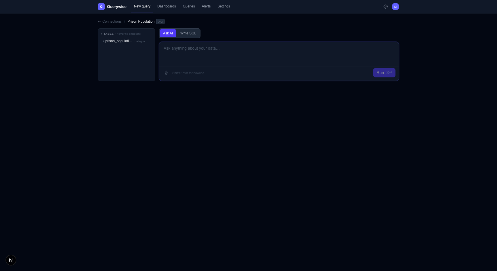
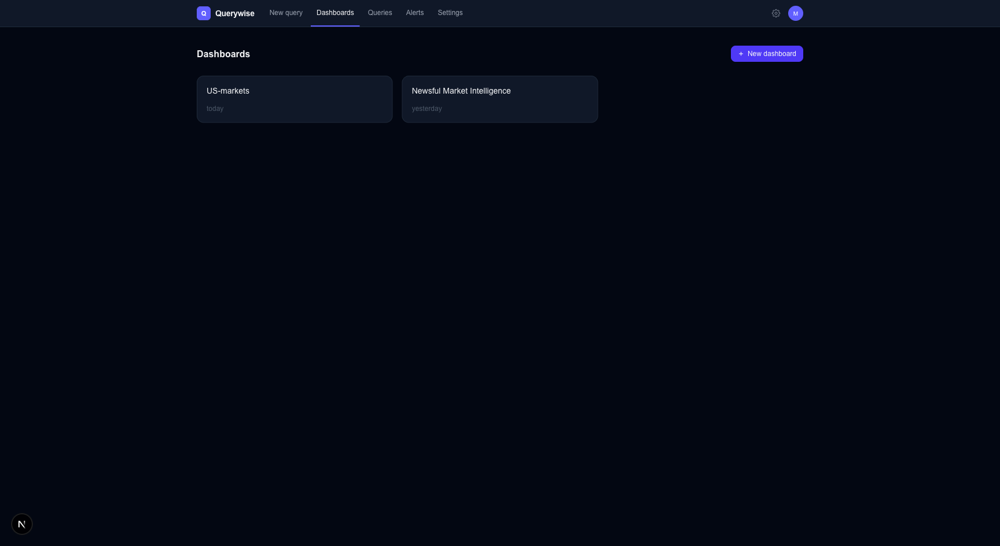
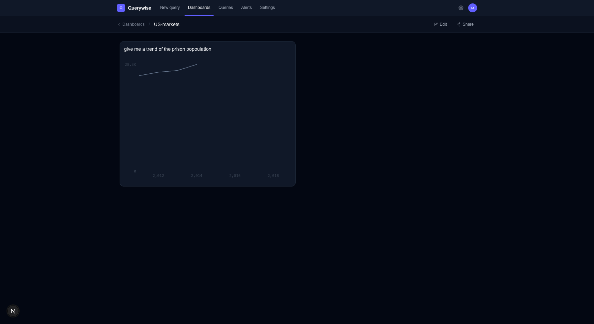
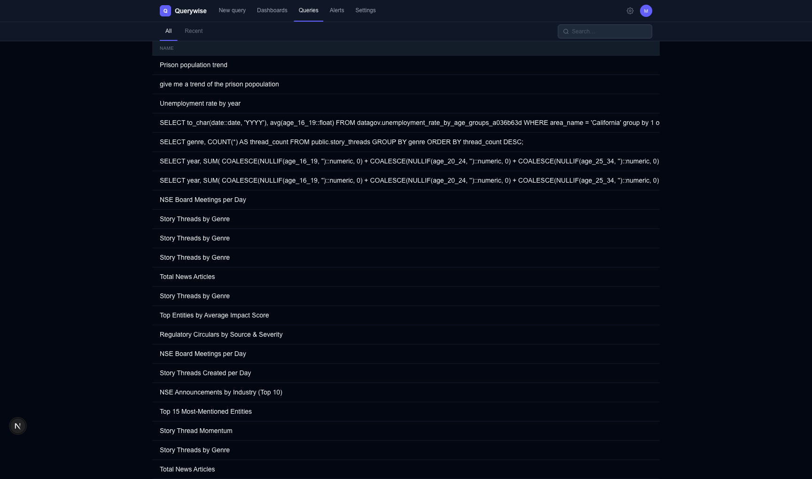
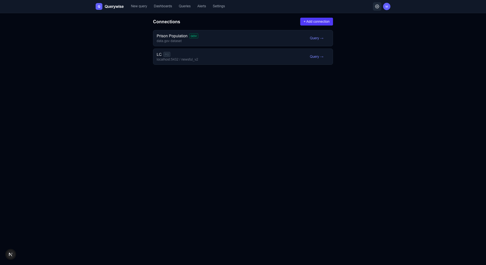
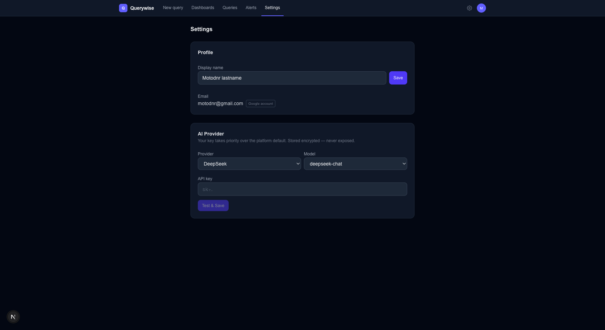

# Querywise

An AI-powered BI tool. Connect your data warehouse, ask questions in plain English, get SQL and charts.



---

## Features

### Ask AI or write SQL
Type a question in plain English — Querywise generates SQL using your schema as context, shows it to you before running, and renders the result as a chart or table. Switch to SQL mode any time to write or edit directly.

### Dashboards
Build dashboards from saved queries. Drag to resize tiles, share with collaborators, rename everything inline.




### Queries
Every query is saved and searchable. Open any past query in the editor, rename it, add it to a dashboard, or export results as CSV or PNG.



### Connections
Connect Postgres or Snowflake, or import public datasets directly from data.gov — no ETL required. Each connection introspects the schema automatically and scopes AI context to that connection.



### Bring your own AI key
Use DeepSeek (default), OpenAI, or OpenRouter. Your key is stored encrypted and takes priority over the platform default. Set it in Settings.



### Charts — 9 types out of the box
Line, bar, scatter, area, histogram, KPI, donut, heatmap, pivot table — powered by Observable Plot. Chart type auto-selected from result shape; override per query.

---

## Stack

| Layer | Tech |
|---|---|
| Frontend | Next.js + Tailwind CSS |
| Backend | FastAPI (Python) |
| Charts | Observable Plot (`packages/charts`) |
| Auth | Supabase (Google OAuth) |
| App DB | Postgres (local) |
| AI | DeepSeek / OpenAI / OpenRouter |
| Encryption | Fernet (AES-128) |

---

## Running locally

### Prerequisites
- Node.js 18+
- Python 3.9+
- Postgres running locally
- A Supabase project (for auth)
- A DeepSeek API key (or OpenAI / OpenRouter)

### 1. Clone and install

```bash
git clone <repo>
cd bi-tool
```

### 2. Backend

```bash
cd backend
python -m venv .venv
source .venv/bin/activate
pip install -r requirements.txt
```

Create `backend/.env`:

```env
DATABASE_URL=postgresql://user@localhost:5432/bi_tool
SUPABASE_URL=https://your-project.supabase.co
SUPABASE_ANON_KEY=your-anon-key
DEEPSEEK_API_KEY=sk-...
ENCRYPTION_KEY=<32-byte Fernet key>
```

Generate an encryption key:
```bash
python -c "from cryptography.fernet import Fernet; print(Fernet.generate_key().decode())"
```

Start the backend:
```bash
uvicorn app.main:app --reload --port 8000
```

### 3. Frontend

```bash
cd frontend
npm install
```

Create `frontend/.env.local`:

```env
NEXT_PUBLIC_SUPABASE_URL=https://your-project.supabase.co
NEXT_PUBLIC_SUPABASE_ANON_KEY=your-anon-key
NEXT_PUBLIC_API_URL=http://localhost:8000
```

Start the frontend:
```bash
npm run dev
```

Open [http://localhost:3000](http://localhost:3000).

---

## Project structure

```
bi-tool/
  backend/
    app/
      api/routes/       # FastAPI route handlers
      services/         # Business logic (AI, connections, encryption…)
      models/           # Pydantic schemas
  frontend/
    app/                # Next.js app router pages
    components/         # Shared UI components
    lib/                # API client, auth, utilities
  packages/
    charts/             # Observable Plot chart library (@bi-tool/charts)
  docs/
    screenshots/        # UI screenshots
  SPEC.md               # Feature spec and build status
  ARCHITECTURE.md       # System design and constraints
```

---

## Spec and roadmap

See [`SPEC.md`](SPEC.md) for the full feature list, build status, and what's coming next.
